# LiteraX — AI-Powered Academic Research Assistant

[](https://www.python.org/)
[](https://fastapi.tiangolo.com/)
[](https://aiogram.dev/)
[](https://www.postgresql.org/)
[](LICENSE)

**LiteraX (Research Automation Bot)** is an intelligent academic research assistant designed to automate the discovery, normalization, analysis, organization, and citation of scientific literature from SINTA, Scopus, OpenAlex, Semantic Scholar, Crossref, and global academic sources.

---

## 🎯 Overview

Conducting literature reviews traditionally requires jumping across disparate search portals, coping with missing metadata, manually extracting methodologies, and fixing misspelled search terms. **LiteraX** consolidates this entire pipeline into an asynchronous, AI-augmented workflow.

### Traditional Workflow vs. LiteraX Workflow

```mermaid
flowchart TD
    subgraph Traditional["Traditional Workflow"]
        T1["Google / Portal"] --> T2["Search"]
        T2 --> T3["Open Papers Individually"]
        T3 --> T4["Copy DOIs & Find PDFs"]
        T4 --> T5["Read Abstracts Manually"]
        T5 --> T6["Extract Methodology & Results"]
        T6 --> T7["Format Citations"]
        T7 --> T8["Compile Literature Review"]
    end

    subgraph LiteraX["LiteraX Workflow"]
        L1["User Raw Query"] --> L2["Fuzzy Auto-Correct & Query Understanding"]
        L2 --> L3["Multi-source Concurrent Search"]
        L3 --> L4["Deduplication & Relevance Ranking"]
        L4 --> L5["AI-Powered Paper Analysis"]
        L5 --> L6["Literature Matrix & Research Gap Assistant"]
        L6 --> L7["Instant Multi-Format Citations"]
    end
```



---

## ✨ Key Capabilities

1. **🧠 Fuzzy Logic Auto-Correct**: Intelligently handles typos, truncated words, and bilingual terms (Indonesian & English) using Levenshtein distance, token similarity, and weighted fuzzy logic confidence scores ($C \ge 0.90$).
2. **🔎 Multi-Source Academic Aggregation**: Concurrently queries OpenAlex, Crossref, Semantic Scholar, Elsevier Scopus, SINTA, GARUDA, DOAJ, arXiv, and PubMed.
3. **🔁 Dynamic Query Expansion**: Expands single research intents into targeted academic permutations (e.g. synonyms, boolean queries, and concept mappings).
4. **🧹 Intelligent Deduplication**: Merges multi-source hits using normalized DOI matching, Title Levenshtein similarity, author overlap, and publication year.
5. **📊 AI Paper Analysis & Extraction**: Extracts structured research components from abstracts and full-text PDFs:
   - Research Problem & Objectives
   - Methodology & Algorithms
   - Datasets & Evaluation Metrics
   - Key Findings & Empirical Results
   - Limitations & Suggested Future Work
6. **🔬 Research Gap & Literature Matrix**: Compares methodologies across multiple papers in a tabular matrix to highlight unexplored datasets, algorithmic combinations, and trade-offs.
7. **📖 Citation Generation**: Generates standard bibliographic citations in APA 7th, IEEE, Harvard, Vancouver, BibTeX, and RIS formats.

---

## 💬 Interactive Example

```text
User:
/search machne lerning untk deteksi phising

LiteraX:
🔎 Did you mean: "machine learning untuk deteksi phishing"?
Confidence: 96%
⚡ Searching OpenAlex, Scopus, Semantic Scholar, and Crossref...

📚 SEARCH RESULTS (Found 42 papers)
━━━━━━━━━━━━━━━━━━━━━━━━━━━━━━━━━━━━━━━━━━━━━━━━━━━━
1. Machine Learning-Based Phishing URL Detection: A Survey
   Year: 2025 | Source: Scopus | Relevance: 96%
   Authors: A. Rahman, S. Kumar
   DOI: 10.1016/j.cose.2024.103982

   Abstract:
   Phishing attacks represent a pervasive threat... This study compares
   Random Forest, XGBoost, and Transformer models on 150k URLs...

   [🔗 DOI] [📄 PDF] [📖 Citation] [🔬 Analyze Paper]
```

---

## 🏗️ System Architecture

```text
                    ┌─────────────────────────┐
                    │     Telegram / Web      │
                    └────────────┬────────────┘
                                 │
                                 ▼
                    ┌─────────────────────────┐
                    │    FastAPI / Bot API    │
                    └────────────┬────────────┘
                                 │
                                 ▼
                    ┌─────────────────────────┐
                    │      Query Engine       │
                    └────────────┬────────────┘
                                 │
              ┌──────────────────┼──────────────────┐
              ▼                  ▼                  ▼
      Fuzzy Auto-Correct   Search Adapters      AI Layer
              │                  │                  │
              └──────────────────┼──────────────────┘
                                 ▼
                    ┌─────────────────────────┐
                    │    Paper Aggregator     │
                    └────────────┬────────────┘
                                 │
                                 ▼
                    ┌─────────────────────────┐
                    │  Deduplication & Rank   │
                    └────────────┬────────────┘
                                 │
                                 ▼
                    ┌─────────────────────────┐
                    │   Research & Matrix     │
                    └─────────────────────────┘
```

---

## 🚀 Quickstart

### 1. Prerequisites
- Python 3.12+
- Docker & Docker Compose
- PostgreSQL 16 with `pgvector`
- Redis 7+

### 2. Installation

```bash
# Clone the repository
git clone https://github.com/fatirgibran/LiteraX.git
cd LiteraX

# Create and activate virtual environment
python3 -m venv .venv
source .venv/bin/activate

# Install dependencies
pip install -r requirements.txt
```

### 3. Configure Environment Variables

```bash
cp .env.example .env
# Edit .env and supply your credentials:
# BOT_TOKEN, DATABASE_URL, REDIS_URL, OPENALEX_EMAIL, SEMANTIC_SCHOLAR_API_KEY, SCOPUS_API_KEY, LLM_API_KEY
```

### 4. Run Services

#### Option A: Docker Compose
```bash
docker compose up -d
```

#### Option B: Bare-Metal / Local (FastAPI + Ollama)
```bash
# Optional: Serve local LLM via Ollama (e.g. llama3, qwen2.5, mistral)
ollama serve &
ollama pull llama3

# Run LiteraX FastAPI Service
uvicorn literax.api.main:app --host 0.0.0.0 --port 8000 --reload
```

### 5. Access the Services
- **FastAPI Documentation & Swagger UI**: [http://localhost:8000/docs](http://localhost:8000/docs)
- **OpenAPI Schema**: [http://localhost:8000/openapi.json](http://localhost:8000/openapi.json)
- **Telegram Bot**: Start a chat with your configured Telegram Bot username.


---

## 📚 Documentation Index

Comprehensive documentation is available in the [`docs/`](docs/README.md) directory:

- **[Tech Stack](docs/TECHSTACK.md)**: Deep dive into the backend, database, NLP, and AI architecture.
- **[Architecture](docs/architecture/ARCHITECTURE.md)**: System design and module interaction.
  - [Data Flow Pipeline](docs/architecture/DATA-FLOW.md)
  - [Provider Architecture](docs/architecture/PROVIDER-ARCHITECTURE.md)
- **[Features](docs/features/FEATURES.md)**: Feature catalogs and execution flows.
  - [Fuzzy Auto-Correct](docs/features/FUZZY-AUTOCORRECT.md)
  - [Search Engine & Ranking](docs/features/SEARCH-ENGINE.md)
  - [Paper Analysis](docs/features/PAPER-ANALYSIS.md)
  - [Research Gap Assistant](docs/features/RESEARCH-GAP.md)
  - [Literature Matrix](docs/features/LITERATURE-MATRIX.md)
  - [Citation Generator](docs/features/CITATION.md)
- **[Integrations](docs/integrations/DATA-SOURCES.md)**: Data sources and provider guides.
  - [SINTA (Indonesia)](docs/integrations/SINTA.md)
  - [Elsevier Scopus](docs/integrations/SCOPUS.md)
  - [OpenAlex](docs/integrations/OPENALEX.md)
  - [Crossref](docs/integrations/CROSSREF.md)
  - [Semantic Scholar](docs/integrations/SEMANTIC-SCHOLAR.md)
- **[Development & Deployment](docs/development/DEVELOPMENT.md)**:
  - [REST API Reference](docs/development/API.md)
  - [Database Schema & pgvector](docs/development/DATABASE.md)
  - [Telegram Bot Guide](docs/development/TELEGRAM-BOT.md)
  - [Production Deployment](docs/development/DEPLOYMENT.md)
- **[Security & Academic Integrity](docs/SECURITY.md)**
- **[Roadmap](docs/ROADMAP.md)**
- **[Contributing](docs/CONTRIBUTING.md)**

---

## ⚠️ Academic Integrity Statement

LiteraX is built strictly as a **research assistant tool**.
- All AI-generated summaries, extracted matrices, and suggested research gaps **must be verified** against the original published peer-reviewed papers.
- LiteraX **never fabricates citations, bypasses paywalls, or accesses unauthorized resources**. All data is queried through public or subscribed legal APIs adhering to each provider's licensing terms.

---

## 🚀 Deployment & Operations

### Docker Compose Quickstart
Run the complete LiteraX stack (PostgreSQL + pgvector, Redis, FastAPI, Telegram Bot) with Docker:

```bash
docker compose up -d --build
```

### Server Setup (Ubuntu / Debian)
For automated bare-metal or cloud VM deployment (Systemd + Nginx):

```bash
chmod +x deploy/setup_server.sh
./deploy/setup_server.sh
```

---

## 🧪 Testing

LiteraX is thoroughly tested using `pytest`. To execute the entire test suite:

```bash
pytest -v
```

To run tests with coverage reporting:

```bash
pytest --cov=literax --cov-report=term-missing
```

---

## 📄 License

This project is licensed under the MIT License - see the [LICENSE](LICENSE) file for details.
