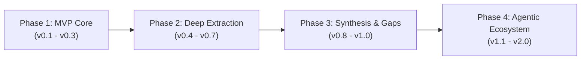

# 🗺️ LiteraX Development Roadmap

This roadmap tracks the developmental trajectory of LiteraX from initial prototype to an enterprise-grade AI Research Suite.

---

## 📌 Milestones Overview

---

## 🚀 Phase 1: Core Search & Fuzzy Auto-Correct (v0.1 – v0.3)
- [x] Basic project layout, async architecture, and Pydantic models.
- [x] RapidFuzz string distance integration with multi-factor confidence scoring.
- [x] Bilingual vocabulary dictionaries (Indonesian & English).
- [x] Protected terms taxonomy (`CNN`, `SVM`, `BERT`, `IoT`).
- [x] OpenAlex & Crossref REST adapters.
- [x] Telegram bot basic search command with pagination cards.

---

## 🔬 Phase 2: Deep Extraction & Provider Expansion (v0.4 – v0.7)
- [x] Elsevier Scopus API adapter with `X-ELS-Insttoken` support.
- [x] SINTA & GARUDA crawler adapter for Indonesian accredited literature.
- [x] Semantic Scholar Graph API adapter with citation counts.
- [x] PDF text extraction and segmentation via `PyMuPDF`.
- [x] Multi-format citation generator (APA 7th, IEEE, Harvard, BibTeX, RIS).
- [x] Automated DOI resolution through Crossref content negotiation caching.

---

## 📑 Phase 3: Synthesis & Research Gap Engine (v0.8 – v1.0)
- [x] Multi-paper Literature Review Matrix generation (`/matrix`).
- [x] Automated Research Gap discovery assistant (`/gap`).
- [x] Export to Markdown, CSV, and formatted Microsoft Excel (`.xlsx`).
- [x] pgvector integration for paper abstract embeddings and semantic search.
- [x] User authentication and persistent personal paper collections (`/save`, `/saved`).
- [x] Fast automated deduplication benchmarking suite.

---

## 🌐 Phase 4: Agentic Ecosystem & Web Dashboard (v1.1 – v2.0)
- [ ] Interactive Web UI dashboard (Next.js / Tailwind CSS) with live search and matrix editing.
- [ ] Multi-agent research crew (Discovery Agent, Methodology Critic, Synthesis Writer).
- [ ] Direct sync integrations with Zotero, Mendeley, and Overleaf.
- [ ] Graph visualization of citation networks and co-authorship clusters.
- [ ] Browser extension for one-click paper ingestion while browsing Google Scholar.
