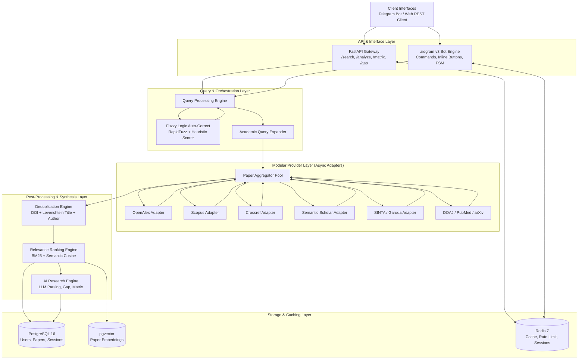

# 🏗️ System Architecture

LiteraX is designed as a modular, layered, asynchronous platform capable of processing natural language academic queries, querying distributed academic providers, and synthesizing literature with AI.

---

## 📐 High-Level Architecture Diagram

---

## 🏛️ Layer Responsibilities

### 1. Interface & Gateway Layer
- **FastAPI**: Serves JSON APIs, handles JWT authentication, enforces rate limits, and coordinates long-running asynchronous jobs.
- **aiogram Bot**: Translates user chat interactions into backend commands, displays paginated search cards, and manages interactive feedback dialogues (e.g. asking confirmation for medium-confidence typos).

### 2. Query & Orchestration Layer
- **Normalization**: Strips non-academic punctuation, lowercases text, collapses whitespace, and preserves boolean operators (`AND`, `OR`, `NOT`).
- **Fuzzy Auto-Correct**: Analyzes tokens against curated academic and multilingual vocabularies (English and Indonesian). Uses multi-factor fuzzy logic scoring to produce candidate corrections with explainable confidence.
- **Query Expander**: Generates targeted synonyms, acronym expansions (e.g. `ML` $\leftrightarrow$ `Machine Learning`), and specialized queries for different database APIs.

### 3. Modular Provider Layer
- Implements the **Adapter Pattern**. Every academic database has a dedicated class inheriting from `ResearchProvider`.
- Search calls are executed in parallel via `asyncio.gather(..., return_exceptions=True)`.
- If an individual provider encounters a rate limit or network glitch, it fails gracefully without blocking other providers.

### 4. Post-Processing & Synthesis Layer
- **Deduplication Engine**: Merges duplicated papers indexed across multiple sources using canonical DOIs and high-precision string matching.
- **Relevance Ranker**: Evaluates search hits against the user's intent using a weighted composite of lexical matching, semantic vector similarity, publication year recency, and citation counts.
- **AI Research Engine**: Orchestrates LLMs to parse paper abstracts and PDFs into structured fields, build comparative matrices, and detect research gaps.

### 5. Persistence & Cache Layer
- **PostgreSQL 16**: Relational storage for users, search history, bibliographic records, and custom literature collections.
- **pgvector**: Stores high-dimensional paper embeddings for semantic similarity checks and paper recommendation.
- **Redis 7**: High-speed key-value store for caching external provider responses, managing bot pagination tokens, and rate limiting.

---

## 🔒 Design Decisions

1. **Async-First Throughout**: All provider interactions, database queries, and bot notifications run asynchronously to avoid blocking the main event loop during slow network calls.
2. **Strict Separation of Concerns**: Query correction is completely independent of search providers. This ensures typo correction can be unit-tested without network requests.
3. **Graceful Degradation**: If LLM services are temporarily unreachable, the search engine still delivers raw metadata, abstract excerpts, and direct links without crashing.
