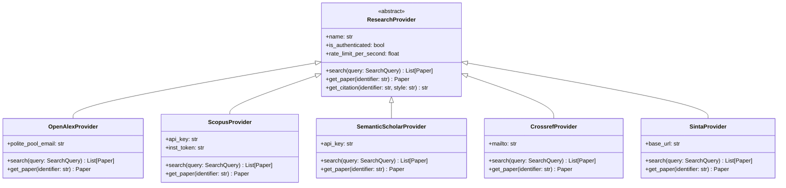

# 🔌 Provider Architecture & Adapter Pattern

LiteraX treats every academic database as an external provider decoupled from core business logic. All providers conform to the `ResearchProvider` abstract base class.

---

## 🏛️ Adapter Architecture Diagram



---

## 📜 Base Class Specification

```python
from abc import ABC, abstractmethod
from typing import List, Optional
from pydantic import BaseModel

class Author(BaseModel):
    name: str
    affiliation: Optional[str] = None
    orcid: Optional[str] = None

class Paper(BaseModel):
    id: str
    title: str
    abstract: Optional[str] = None
    doi: Optional[str] = None
    year: Optional[int] = None
    authors: List[Author] = []
    journal: Optional[str] = None
    citation_count: int = 0
    source: str
    open_access: bool = False
    full_text_url: Optional[str] = None
    landing_page_url: Optional[str] = None

class SearchQuery(BaseModel):
    raw_query: str
    expanded_queries: List[str] = []
    year_start: Optional[int] = None
    year_end: Optional[int] = None
    limit: int = 10
    open_access_only: bool = False

class ResearchProvider(ABC):
    """Abstract interface for all academic providers."""
    name: str
    requires_auth: bool = False
    
    @abstractmethod
    async def search(self, query: SearchQuery) -> List[Paper]:
        """Execute search against the academic source."""
        raise NotImplementedError
    
    @abstractmethod
    async def get_paper(self, identifier: str) -> Optional[Paper]:
        """Retrieve detailed metadata for a single paper by DOI or ID."""
        raise NotImplementedError

    @abstractmethod
    async def get_citation(self, identifier: str, style: str = "apa") -> str:
        """Fetch formatted citation string from provider."""
        raise NotImplementedError
```

---

## ⚡ Concurrency & Aggregation Pool

The `PaperAggregator` class coordinates searches across active providers:

```python
import asyncio
from typing import List

class PaperAggregator:
    def __init__(self, providers: List[ResearchProvider]):
        self.providers = providers

    async def search_all(self, query: SearchQuery) -> List[Paper]:
        """Queries all enabled providers concurrently with error isolation."""
        tasks = [provider.search(query) for provider in self.providers]
        results = await asyncio.gather(*tasks, return_exceptions=True)
        
        aggregated_papers: List[Paper] = []
        for provider, res in zip(self.providers, results):
            if isinstance(res, Exception):
                # Log provider failure without crashing search
                print(f"[WARN] Provider {provider.name} failed: {res}")
            elif isinstance(res, list):
                aggregated_papers.extend(res)
                
        return aggregated_papers
```

---

## 🛡️ Resilience & Rate Limiting

1. **Token Bucket Rate Limiting**: Each provider adapter tracks its individual requests per second using Redis or an in-memory token bucket.
2. **Polite Headers**: Open-access APIs (such as OpenAlex and Crossref) require contact information in HTTP headers (`mailto:` or `User-Agent`). Adapters automatically attach configured email headers to place requests into high-speed "polite pools".
3. **Timeout Isolation**: Network calls are strictly bounded (default 5.0 seconds). A lagging provider is aborted without delaying responses from faster sources.

---

## ➕ Adding a New Provider

To add a new provider (e.g. `ArxivProvider`):
1. Create a new file `src/literax/providers/arxiv.py`.
2. Subclass `ResearchProvider` and implement `search()` and `get_paper()`.
3. Map API response data into the canonical `Paper` Pydantic model.
4. Register the new provider in `src/literax/providers/__init__.py`.
5. Add test coverage in `tests/providers/test_arxiv.py`.
