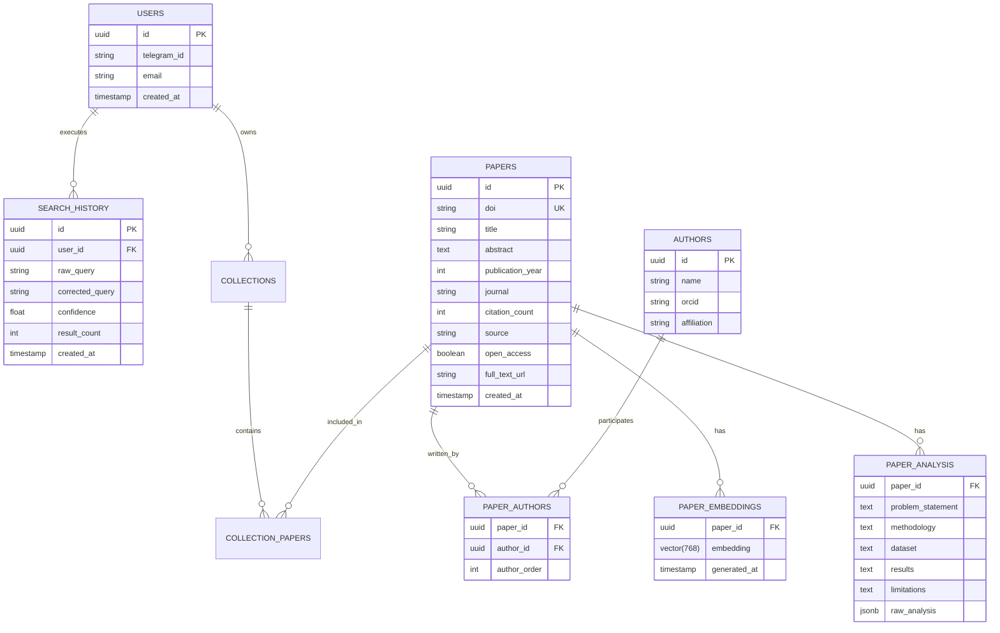

# 🗄️ Database Schema & Vector Architecture

LiteraX leverages **PostgreSQL 16** with the **`pgvector`** extension for relational metadata storage and high-speed semantic vector retrieval.

---

## 📐 Entity-Relationship Diagram (ERD)



---

## 📜 PostgreSQL DDL Schema

```sql
-- Enable vector extension
CREATE EXTENSION IF NOT EXISTS "uuid-ossp";
CREATE EXTENSION IF NOT EXISTS vector;

-- Papers Table
CREATE TABLE papers (
    id UUID PRIMARY KEY DEFAULT uuid_generate_v4(),
    doi VARCHAR(255) UNIQUE,
    title TEXT NOT NULL,
    abstract TEXT,
    publication_year INT,
    journal VARCHAR(255),
    citation_count INT DEFAULT 0,
    source VARCHAR(50) NOT NULL,
    open_access BOOLEAN DEFAULT FALSE,
    full_text_url TEXT,
    landing_page_url TEXT,
    created_at TIMESTAMP WITH TIME ZONE DEFAULT NOW()
);

-- Authors Table
CREATE TABLE authors (
    id UUID PRIMARY KEY DEFAULT uuid_generate_v4(),
    name VARCHAR(255) NOT NULL,
    orcid VARCHAR(50),
    affiliation TEXT
);

-- Paper Authors Join Table
CREATE TABLE paper_authors (
    paper_id UUID REFERENCES papers(id) ON DELETE CASCADE,
    author_id UUID REFERENCES authors(id) ON DELETE CASCADE,
    author_order INT NOT NULL,
    PRIMARY KEY (paper_id, author_id)
);

-- Vector Embeddings Table (pgvector)
CREATE TABLE paper_embeddings (
    paper_id UUID PRIMARY KEY REFERENCES papers(id) ON DELETE CASCADE,
    embedding VECTOR(768) NOT NULL,
    model_name VARCHAR(100) DEFAULT 'text-embedding-004',
    generated_at TIMESTAMP WITH TIME ZONE DEFAULT NOW()
);

-- HNSW Vector Index for blazing fast Cosine Distance Retrieval
CREATE INDEX idx_paper_embeddings_hnsw 
ON paper_embeddings 
USING hnsw (embedding vector_cosine_ops)
WITH (m = 16, ef_construction = 64);

-- Full-text Search Index for Lexical Fallback
CREATE INDEX idx_papers_title_trgm ON papers USING gin (title gin_trgm_ops);
```

---

## ⚡ Vector Similarity Query

Finding the top 5 semantically similar papers to a given query embedding:

```sql
SELECT 
    p.id,
    p.title,
    p.doi,
    1 - (e.embedding <=> $1::vector) AS cosine_similarity
FROM paper_embeddings e
JOIN papers p ON p.id = e.paper_id
ORDER BY e.embedding <=> $1::vector ASC
LIMIT 5;
```
*(where `<=>` is the cosine distance operator in `pgvector`)*.
