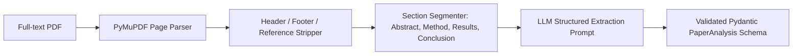

# 📄 AI Paper Analysis & Extraction

LiteraX features an automated paper parsing engine that transforms scientific papers (from abstracts or full-text PDFs) into structured research taxonomies.

---

## 🎯 Extraction Objectives

Reading scientific literature manually takes significant time. LiteraX decomposes each paper into 10 structured fields:

1. **Research Problem**: The underlying domain issue, security flaw, or scientific hurdle.
2. **Research Objective**: The explicit hypothesis or system goal the authors attempt to prove.
3. **Methodology**: Experimental setup, architectural paradigms, or statistical design.
4. **Dataset**: Name, size, collection time window, data source, and preprocessing steps.
5. **Variables**: Independent, dependent, and control variables (or feature vectors).
6. **Model / Algorithm**: Exact models evaluated (e.g. Random Forest, BERT, CNN, XGBoost).
7. **Evaluation Metrics**: Metrics tracked (Accuracy, F1-Score, AUC-ROC, Inference Latency).
8. **Results**: Key quantitative findings and statistical breakthroughs.
9. **Limitations**: Constraints acknowledged by authors (e.g., small dataset size, high computational cost).
10. **Future Work**: Suggested extensions and open questions.

---

## 🏗️ PDF Ingestion Pipeline (PyMuPDF)

When an Open Access PDF is available, LiteraX uses `PyMuPDF` (`fitz`) to extract structured text sections:



### Text Extraction Implementation

```python
import fitz  # PyMuPDF
from typing import Dict

def extract_pdf_sections(pdf_path: str) -> Dict[str, str]:
    doc = fitz.open(pdf_path)
    full_text = []
    
    for page in doc:
        # Extract text blocks, skipping page headers and footers
        text = page.get_text("text")
        full_text.append(text)
        
    combined = "\n".join(full_text)
    # Return extracted string capped at context window limit
    return {"raw_text": combined[:30000]}
```

---

## 📋 Structured Pydantic Schema

```python
from pydantic import BaseModel, Field
from typing import List, Optional

class PaperAnalysis(BaseModel):
    doi: Optional[str] = None
    title: str
    problem_statement: str = Field(description="Primary research problem or gap")
    research_objective: str = Field(description="Goals set by authors")
    methodology: str = Field(description="System pipeline, experiment design")
    dataset: str = Field(description="Dataset name, count of samples, features")
    algorithms_used: List[str] = Field(description="List of ML/DL or statistical models")
    evaluation_metrics: List[str] = Field(description="Metrics such as Accuracy, F1, Precision")
    key_findings: str = Field(description="Concrete numerical findings and outcomes")
    limitations: str = Field(description="Drawbacks, assumptions, or dataset limitations")
    future_work: Optional[str] = Field(description="Future directions recommended by authors")
```

---

## 🔬 Sample Output (Phishing Detection Paper)

```json
{
  "title": "Machine Learning Approaches for Phishing URL Detection: An Empirical Study",
  "problem_statement": "Rapid evolution of zero-day phishing websites evades conventional blacklists.",
  "research_objective": "Benchmark traditional classifiers against transformer architectures on unbalanced URL datasets.",
  "methodology": "Lexical feature engineering combined with BERT tokenization; 10-fold cross validation.",
  "dataset": "PhishTank and UNB Phishing 2023 (120,000 samples, 80/20 train/test split).",
  "algorithms_used": ["Random Forest", "XGBoost", "DistilBERT"],
  "evaluation_metrics": ["Accuracy", "F1-Score", "False Positive Rate (FPR)"],
  "key_findings": "DistilBERT achieved 98.4% accuracy with 0.8% FPR, outperforming Random Forest by 3.2% in detecting obfuscated domains.",
  "limitations": "High computational latency of BERT (45ms per URL) makes it challenging for real-time edge firewall deployment.",
  "future_work": "Knowledge distillation into lightweight models and resilience testing against adversarial URL perturbations."
}
```
