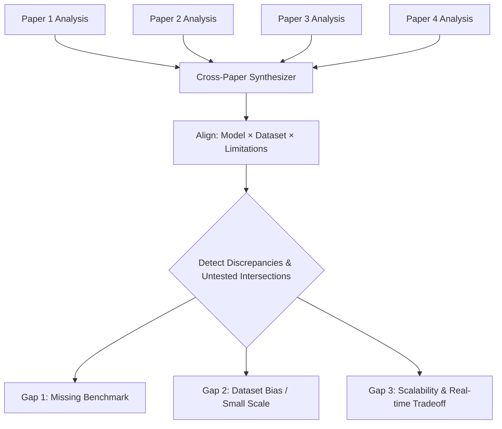

# 🔬 Research Gap Assistant

The **Research Gap Assistant** compares a cluster of scientific papers retrieved for a topic and synthesizes potential research opportunities and unexplored questions.

---

## 🎯 What is an Academic Research Gap?

A research gap is an unaddressed area, contradiction, or methodological blind spot in existing literature. Common academic gaps include:
1. **Methodological Blind Spot**: Model $A$ has been tested on Dataset $X$, Model $B$ on Dataset $Y$, but no rigorous comparative benchmark exists between $A$ and $B$ under identical conditions.
2. **Dataset & Domain Shift**: Techniques proven effective in high-resource domains (e.g. English text) remain unvalidated in localized or low-resource settings (e.g. Indonesian phishing attacks).
3. **Evaluation Deficiencies**: Previous works report high accuracy but omit evaluation on adversarial robustness, latency, or concept drift over time.

---

## 🔄 Cross-Paper Analysis Workflow



---

## 📊 Comparative Demonstration

Given three analyzed papers on machine learning for phishing detection:

| Paper | Year | Method | Dataset | Key Result | Limitation |
| :--- | :--- | :--- | :--- | :--- | :--- |
| **Paper A (Rahman et al.)** | 2025 | Random Forest | Dataset X (10k URLs) | 95.2% Accuracy | Small dataset; lacks deep learning baseline |
| **Paper B (Chen et al.)** | 2024 | CNN-LSTM | Dataset Y (50k URLs) | 97.1% Accuracy | High latency; evaluated only on English domains |
| **Paper C (Santoso et al.)** | 2023 | SVM + TF-IDF | Dataset X (10k URLs) | 93.0% Accuracy | Fails on shortened URLs and character homoglyphs |

---

## 💡 Synthesized Research Gap Output

```markdown
### 🎯 Identified Research Gaps

1. **Benchmark Consistency Gap**:
   - *Observation*: Paper A and Paper C both evaluated classical models (Random Forest and SVM) on Dataset X, while Paper B tested deep learning (CNN-LSTM) exclusively on Dataset Y.
   - *Gap*: There is no direct comparative empirical study benchmarking CNN-LSTM against Random Forest on the same standardized dataset under identical feature representations.

2. **Homoglyph & Internationalized Domain Names (IDN) Gap**:
   - *Observation*: Paper C noted failure on character homoglyphs, and Paper B only evaluated English ASCII URLs.
   - *Gap*: Phishing attacks leveraging multilingual homoglyphs (e.g. Cyrillic/Indonesian character substitutions) remain largely untested with modern transformer architectures.

3. **Real-time Inference vs. Accuracy Trade-off**:
   - *Observation*: Paper B achieved the highest accuracy (97.1%) but reported severe latency bottlenecks.
   - *Gap*: Potential research opportunity in applying model quantization or knowledge distillation to achieve sub-10ms inference without sacrificing the detection accuracy of deep networks.
```

---

## ⚠️ Academic Verification Notice

The Research Gap Assistant provides **heuristic candidates** derived from metadata and abstracts. Researchers must:
- Verify original full-text papers before claiming novelty.
- Review recent preprints to ensure the gap was not addressed in very recent literature.
- Ensure ethical grounding for proposed experiments.
