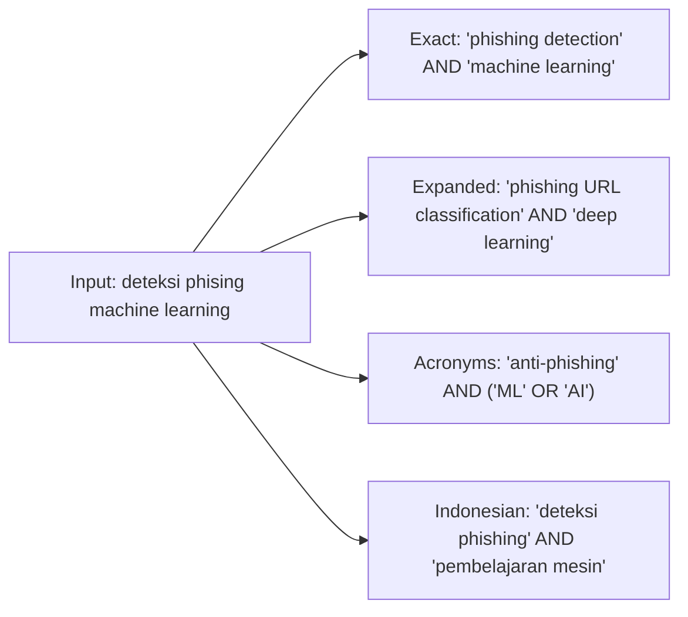
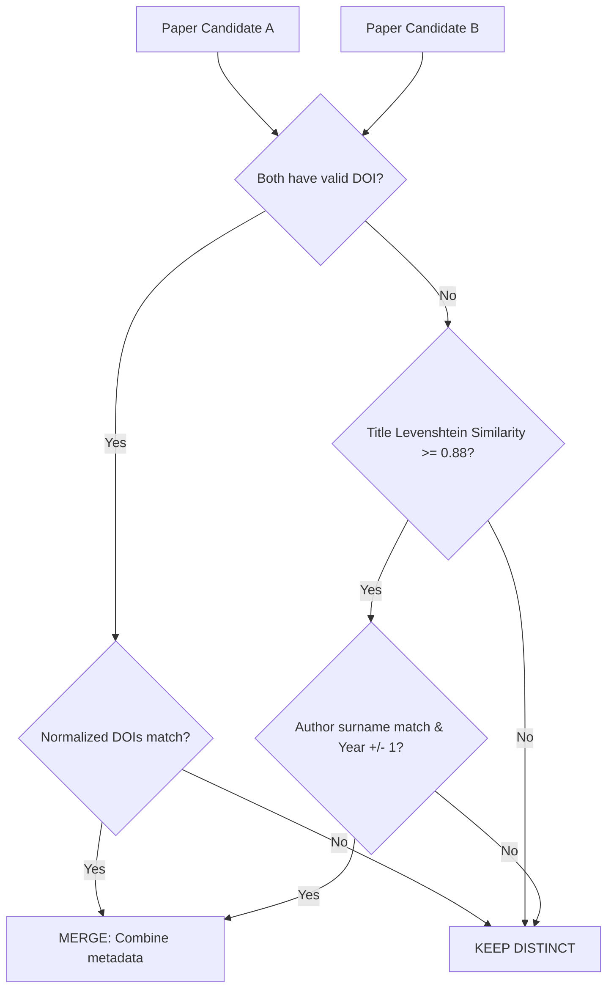

# 🔎 Multi-Source Search & Ranking Engine

The **LiteraX Search Engine** aggregates literature across decentralized academic providers, eliminates duplicate records, and computes relevance scores tailored to scientific intent.

---

## 🔁 1. Query Expansion & Translation

Different academic portals demand different search syntax. LiteraX expands a user's single natural language query into multiple specialized variants:



### Expansion Strategies
1. **Bilingual Bridging**: Queries submitted in Indonesian are translated to English terms for Scopus and OpenAlex, while preserving Indonesian keywords for SINTA and GARUDA.
2. **Taxonomy & Synonym Injection**: Uses computer science ontology to map concepts (e.g. `LLM` $\rightarrow$ `Large Language Model` $\leftrightarrow$ `Transformer`).
3. **Boolean Syntax Construction**: Encapsulates phrases in double quotes (`"..."`) and connects them with boolean `AND`/`OR` operators where supported.

---

## 🧹 2. Paper Deduplication Algorithm

When querying 5+ providers simultaneously, the same paper often returns from OpenAlex, Crossref, and Semantic Scholar. LiteraX uses a 4-tier deduplication algorithm:



### Merging Rules:
- **DOI Normalization**: Strips `https://doi.org/`, `http://dx.doi.org/`, and lowercases all characters (`10.1145/3372224.3380889`).
- **Metadata Fusion**: When merging records, LiteraX creates a single canonical `Paper` object prioritizing:
  - Full-text URL from Open Access providers.
  - Citation counts from Scopus or Semantic Scholar.
  - Abstract completeness from Crossref or OpenAlex.

---

## ⚖️ 3. Multi-Factor Relevance Ranking

Raw search engine rankings vary widely. LiteraX computes a normalized **Composite Relevance Score** $R \in [0.0, 1.0]$:

$$R = 0.35 \cdot S_{\text{semantic}} + 0.25 \cdot S_{\text{bm25}} + 0.15 \cdot S_{\text{recency}} + 0.15 \cdot S_{\text{citation}} + 0.10 \cdot S_{\text{source}}$$

### Scoring Components:
1. **Semantic Vector Similarity ($S_{\text{semantic}}$)**: Cosine similarity between query embedding and paper title + abstract embedding via `pgvector`.
2. **Lexical Match ($S_{\text{bm25}}$)**: BM25 keyword frequency score of query tokens within title and abstract.
3. **Publication Recency ($S_{\text{recency}}$)**: Exponential decay model favoring recent breakthroughs:
   $$S_{\text{recency}} = e^{-\lambda (Y_{\text{current}} - Y_{\text{pub}})}$$
   *(where $\lambda = 0.08$ for rapid computing domains)*.
4. **Citation Impact ($S_{\text{citation}}$)**: Normalized log scale:
   $$S_{\text{citation}} = \min\left(1.0, \frac{\log_{10}(\text{citations} + 1)}{3.0}\right)$$
5. **Source Quality ($S_{\text{source}}$)**: Indexing tier bonus (e.g. Scopus Q1/Q2, SINTA S1/S2 receive $1.0$; unindexed receives $0.6$).

---

## 📊 Sample Ranking Output

```json
[
  {
    "title": "Machine Learning Approaches for Phishing URL Detection: An Empirical Study",
    "year": 2024,
    "source": "Scopus",
    "doi": "10.1016/j.cose.2024.103982",
    "citations": 34,
    "composite_relevance": 0.942,
    "score_breakdown": {
      "semantic": 0.95,
      "lexical_bm25": 0.92,
      "recency": 0.98,
      "citation_impact": 0.72,
      "source_tier": 1.0
    }
  }
]
```
